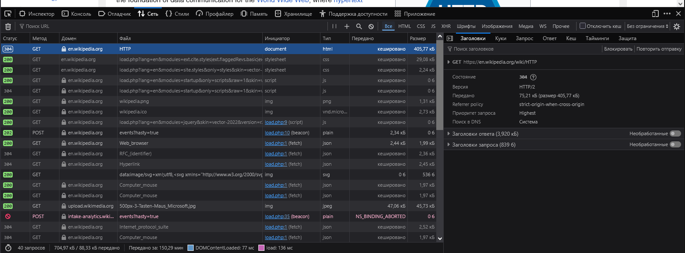

Лабораторная работа №1. HTTP

Цель работы

    Понять, что происходит, когда пользователь открывает сайт.
    Научиться находить и анализировать HTTP-запросы в браузере.
    Разобраться в назначении методов GET, POST, PUT, DELETE.

Задание 1. Анализ HTTP-запросов. Часть 1

