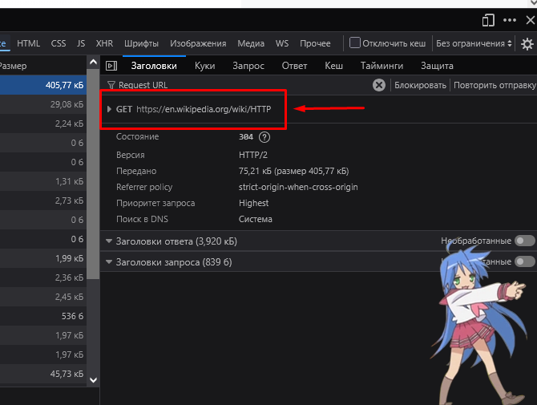
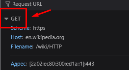
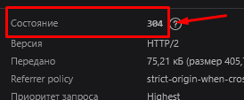
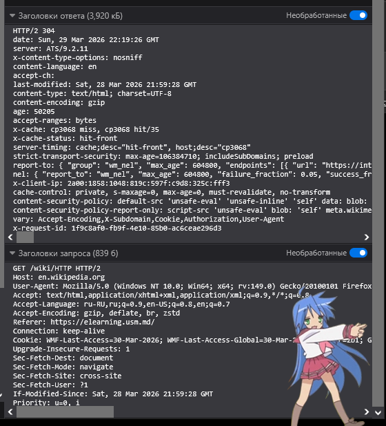
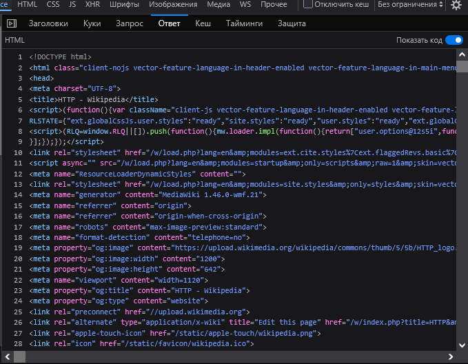
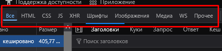
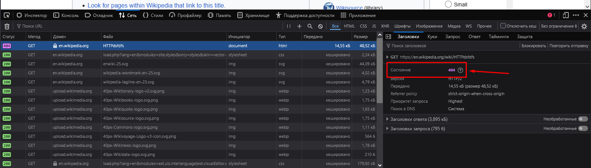

Лабораторная работа №1. HTTP

Цель работы

    Понять, что происходит, когда пользователь открывает сайт.
    Научиться находить и анализировать HTTP-запросы в браузере.
    Разобраться в назначении методов GET, POST, PUT, DELETE.

___________________________________________________________________

Задание 1. Анализ HTTP-запросов. Часть 1

URL: https://en.wikipedia.org/wiki/HTTP

___________________________________________________________________

Метод: GET 

    используется для получения страницы
    

___________________________________________________________________

Сосотояние: 304

    Код "HTTP 304 Not Modified" клиента указывает, 
    что нет необходимости повторно передавать запрошенные 
    ресурсы. Это неявное перенаправление на кешированный ресурс. 
    Это происходит, когда метод safe, например GET или HEAD запрос

___________________________________________________________________

Заголовки запроса и ответа.

    (Содержат информацию о браузере, формате данных и соединении.)
    

___________________________________________________________________

Тело запроса и ответа

    Тело запроса: отсутствует

    
Тело ответа: 

    HTML код страницы
    

___________________________________________________________________

7.Дополнительные запросы

    Используются для загрузки стилей, скриптов и изображений.

___________________________________________________________________

...
...

___________________________________________________________________

9.https://en.wikipedia.org/wiki/HTTPdsfdfs

Ошибка 404
URL: https://en.wikipedia.org/wiki/HTTPdsfdfs

    Статус: 404 Not Found
    Причина: страница не существует

___________________________________________________________________

Задание 2

1)URL запроса. Какой URL используется для выполнения поиска?

https://en.wikipedia.org/w/index.php?search=intitle:browser&title=Special:Search&profile=advanced&fulltext=1&advancedSearch-current={"fields":{"intitle":"browser"}}&ns0=1

___________________________________________________________________

2)Метод запроса. Почему используется именно этот метод?

Метод: GET, потому что параметры поиска передаются через URL

___________________________________________________________________

3)Query Parameters. Какие параметры передаются в запросе, что они означают и для чего используются?

    search=intitle:browser
    title=Special:Search
    
search — содержит поисковый запрос (browser)
title — указывает страницу поиска
